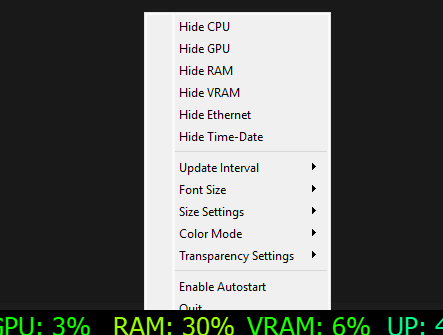

# Windows Taskbar Resource Monitor Widget

A simple and customizable resource monitor widget for Windows 10/11 that displays the current usage of CPU, GPU, RAM, WEB upload and download speed, TIME with seconds and DATE. The widget can be resized and moved freely on the screen or fixed in a specific position.

## Features
- Monitors CPU, GPU, RAM, WEB upload and download speed, TIME with seconds and DATE.
- Resizable and movable widget.
- Supports background and text transparency control.
- Allows customization of font size and update interval.
- Color mode options: system colors, dynamic color based on usage.

## Requirements
- Python 3.x

## Based on
https://github.com/AlexKlos/ResourceMonitor  
